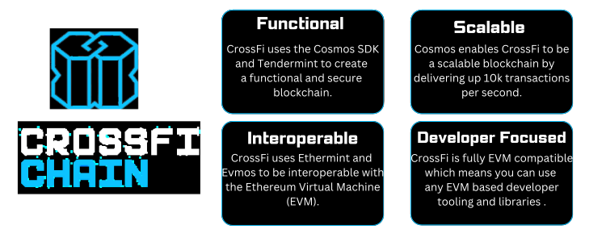

# 🏠 Getting Started

## Welcome to CrossFi Chain documentation!

Here, you'll find comprehensive information about how CrossFi Chain operates and how its components interact.&#x20;

Discover the fundamentals of blockchain technology, delve into the interaction of CrossFi Chain's components, and explore the unique advantages it offers. This guide will help you understand the basics of development, learn about node operations, and uncover all the benefits of the CrossFi blockchain.

Whether you're a developer looking to harness the power of CrossFi's modular architecture or a blockchain enthusiast eager to explore its features, this documentation provides the knowledge and tools you need to engage effectively with the CrossFi ecosystem.

## About CrossFi Chain

<figure><figcaption></figcaption></figure>

CrossFi Chain is a groundbreaking layer 1 blockchain that provides an inclusive, next-generation solution that bridges fiat and cryptocurrency seamlessly.

Built on a synchronized modular architecture combining Cosmos and EVM, it powers a decentralized network of secure, interoperable services. \
Each part is responsible for its specific functionality, with their work completely synchronized as a single organism.

<figure><figcaption></figcaption></figure>

## Explore the Documentation

For easy navigation, please refer to the block below, which provides a list of the main pages in each section.

<table data-view="cards"><thead><tr><th></th><th></th><th></th><th data-hidden data-card-cover data-type="files"></th></tr></thead><tbody><tr><td><a href="overview/architecture/cosmos-and-evm-role.md">The Role of Cosmos</a></td><td><a href="overview/architecture/cosmos-and-evm-role.md">The Role of the EVM </a></td><td><a href="overview/crossfi-chain-overview.md">CrossFi Chain Overview</a></td><td><a href=".gitbook/assets/Developers (2).svg">Developers (2).svg</a></td></tr><tr><td><a href="developers/evm/deploying-smart-contracts.md">Deploy a Contract</a></td><td><a href="developers/configuring-a-wallet.md">Configure a Wallet</a></td><td><a href="developers/connect-a-frontend/">Connect a Frontend</a></td><td><a href=".gitbook/assets/Developers (3).svg">Developers (3).svg</a></td></tr><tr><td><a href="node-operators/join-a-network.md">Join a Network</a></td><td><a href="node-operators/becoming-a-validator/">Become a Validator</a></td><td><a href="node-operators/setting-up-the-crossfi-chain-client/">CrossFi Chain Client</a></td><td><a href=".gitbook/assets/Developers (4).svg">Developers (4).svg</a></td></tr><tr><td><a href="api-and-endpoints/api-and-available-endpoints.md">Available Endpoints </a></td><td><a href="api-and-endpoints/xfi-scan-api.md">XFI Scan API </a></td><td><a href="api-and-endpoints/available-rpc-api-validators.md">RPC / API Validators </a></td><td><a href=".gitbook/assets/Developers (8).svg">Developers (8).svg</a></td></tr><tr><td><a href="https://crossfi.org/#journey">The CrossFi Ecosystem </a></td><td><a href="https://medium.com/@crossfichain">CrossFi Blog </a></td><td><a href="https://discord.com/invite/crossfi">Discord </a></td><td><a href=".gitbook/assets/Developers (9).svg">Developers (9).svg</a></td></tr><tr><td><a href="economy-overview/">Native Coins Overview </a></td><td><a href="economy-overview/mpx-coin/">MPX Coin </a></td><td><a href="economy-overview/xfi-coin.md">XFI Coin </a></td><td><a href=".gitbook/assets/Developers (10).svg">Developers (10).svg</a></td></tr></tbody></table>

