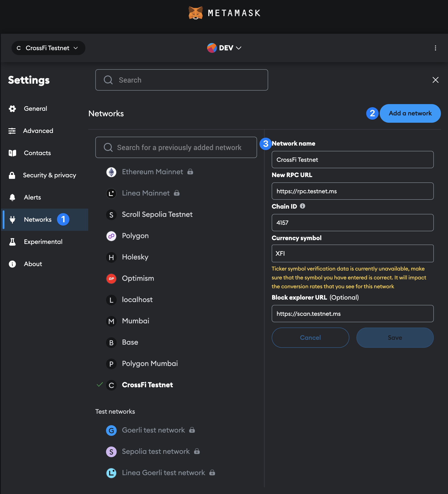

# Configuring a Wallet

You can connect MetaMask or your development framework to a CrossFi chain using the following:

## Mainnet

| Field        | Value                                              |
| ------------ | -------------------------------------------------- |
| Name         | CrossFi Mainet                                     |
| RPC URL      | [https://rpc.mainnet.ms/](https://rpc.mainnet.ms/) |
| Chain ID     | 4158                                               |
| Token symbol | XFI                                                |
| Explorer URL | [https://xfiscan.com/](https://test.xfiscan.com/)  |

## Testnet

| Field        | Value                                                                    |
| ------------ | ------------------------------------------------------------------------ |
| Name         | CrossFi Testnet                                                          |
| RPC URL      | [https://tendermint-rpc.testnet.ms/](https://tendermint-rpc.testnet.ms/) |
| Chain ID     | 4157                                                                     |
| Token symbol | XFI                                                                      |
| Explorer URL | [https://test.xfiscan.com/](https://test.xfiscan.com/)                   |

### Configuring Metamask&#x20;

<figure><figcaption></figcaption></figure>

#### To Add the CrossFi Testnet to Metamask&#x20;

1. Open the **Settings** page from the Metamask extension. Then select **Networks** from the left panel.&#x20;
2. From this page, click on the "Add a Network" button on the right of the page.&#x20;
3. Copy the above network information for the CrossFi Testnet or CrossFi Mainet into the form fields and click save.&#x20;


You may recieve warning abouts verification of the CrossFi currecny symbol. If the information you entered is exactly like the above, you can ignore these warnings.&#x20;


### Configuring Keplr

<figure><figcaption></figcaption></figure>

#### To Add the CrossFi Testnet to Keplr

1. Go to [https://chains.keplr.app/ ](https://chains.keplr.app/)
2. Search for CrossFi Testnet&#x20;
3. Click add to Keplr
