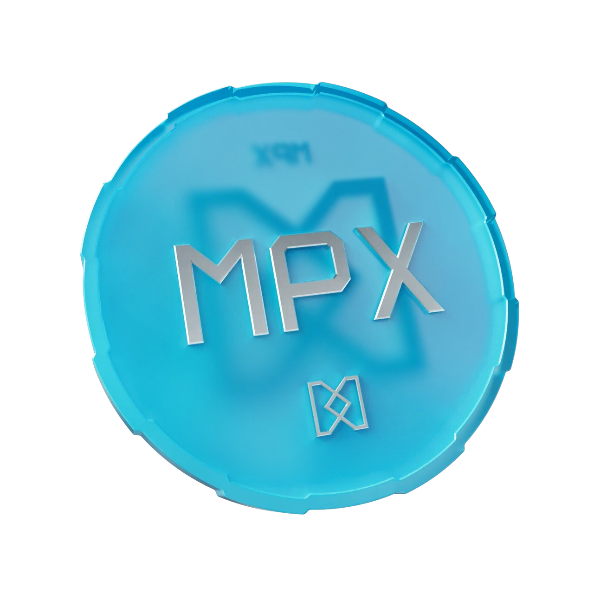
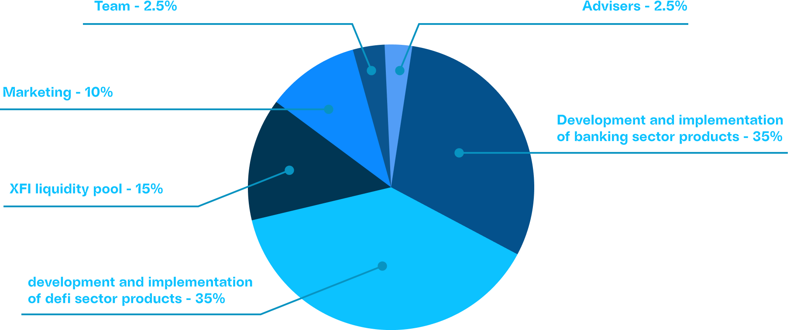

# MPX Coin

<figure><figcaption></figcaption></figure>

Mint Power (MPX) is the governance token and core component of the CrossFi Chain ecosystem. It ensures network consensus, stability, and decentralized governance. MPX is a non-volatile token with unlimited emission, essential for generating new XFI tokens through staking and for paying transaction fees within the Cosmos blockchain.

***

### Key Specifications of MPX Token

| Parameter        | Value                   |
| ---------------- | ----------------------- |
| Symbol           | MPX                     |
| Ticker           | MPX                     |
| Initial Emission | 4,000,000,000           |
| Maximum Emission | Unlimited               |
| Decimals         | 18                      |
| Format           | Cosmos-based blockchain |

***

### Role of MPX in CrossFi Ecosystem

#### 1. Staking and XFI Generation

MPX serves as the foundational asset for staking, providing users with passive income in the form of XFI tokens. Staking encourages users to actively contribute to network security and stability.

Detailed information about the staking mechanism, validator operation principles, and protection against validator misconduct can be found on the [XFI-MPX Staking Protocol](../../ecosystem/xfi-console/native-staking-protocol.md).


[native-staking-protocol.md](../../ecosystem/xfi-console/native-staking-protocol.md)


#### 2. Decentralized Governance

MPX acts as the primary token facilitating decentralized autonomous organization (DAO) governance within CrossFi. Token holders participate in critical decisions, including protocol updates, network modifications, and strategic initiatives.

The voting power of each user is directly proportional to the amount of MPX staked. More information about DAO governance principles can be found on the [DAO page](../../ecosystem/xfi-console/governance-dao.md).


[governance-dao.md](../../ecosystem/xfi-console/governance-dao.md)


#### 3. Transaction Fee Payments

MPX is used to cover transaction fees and access services built on the Cosmos blockchain, ensuring efficient network operation and encouraging active utilization.

#### 4. Cosmos-EVM Layer Integration

MPX connects the Cosmos layer responsible for consensus and block creation with the EVM-compatible layer, providing users access to decentralized financial applications (DeFi). This integration enhances the token’s functionality, making MPX a crucial component of the CrossFi ecosystem.

***

### eMPX: Tokenized MPX on CrossFi EVM

MPX is not inherently tradeable within the Cosmos layer of CrossFi. To expand its usability and enable free trading, **eMPX** was developed as a tokenized version of MPX, compatible with Ethereum. eMPX allows users to participate in liquidity pools and trade across EVM-compatible platforms. Users can convert eMPX back into MPX at any time to engage in staking and governance within the Cosmos network. eMPX has a limited supply, similar to XFI, ensuring token value preservation through scarcity. More details are available on the [eMPX page.](empx-token.md)


[empx-token.md](empx-token.md)


***

### Economic Model

MPX features a flexible emission model, enabling the network to adapt dynamically to increasing demand. The token's unlimited emission ensures continuous availability for new participants without encountering scarcity, guaranteeing that every network user has sufficient resources for staking, governance participation, and other activities.

Access to MPX is provided exclusively through the CrossFi platform. MPX tokens are not intended for trading on external exchanges. This strategy eliminates external price manipulation risks and preserves network integrity, centralizing economic activity within the CrossFi ecosystem.

***

### Distribution of funds from the implementation of MPX

All funds coming from the MPX implementation have the following distribution:

<figure><figcaption></figcaption></figure>

### $ APR

APR is an annual interest rate that is calculated to measure the yield of MPX coin staking, excluding compound interest.\
\
APR has a dynamic value that can change at any time. APR directly depends on the XFI coin rate, the total MPX stake in the network and is calculated using the following formula:

$$
APR=\frac{XP*B*E}{M*MP}*100
$$

**Constants:**

* _B_ - number of blocks per year (6,307,200)
* _E_ - XFI emission per block (5), changes every 4 years according to the emission algorithm.
* _MP_ - MPX rate (0.02$)

**Variables:**    &#x20;

* _XP_ - XFI rate ($)
* _M_ - total MPX stake in the network


Since the stake is in MPX and the rewards come in XFI, the interest rate is calculated in $ to MPX.


**Example:**    &#x20;

* &#x20;_XP_ = $1.59
* _M_ = 10 000 000 000 MPX

With these rates, the APR is 25%. A stake of 50,000 MPX ( $1,000 ) will yield 148 XFIs for the year.  Their value will be $250 (12,500 MPX).

