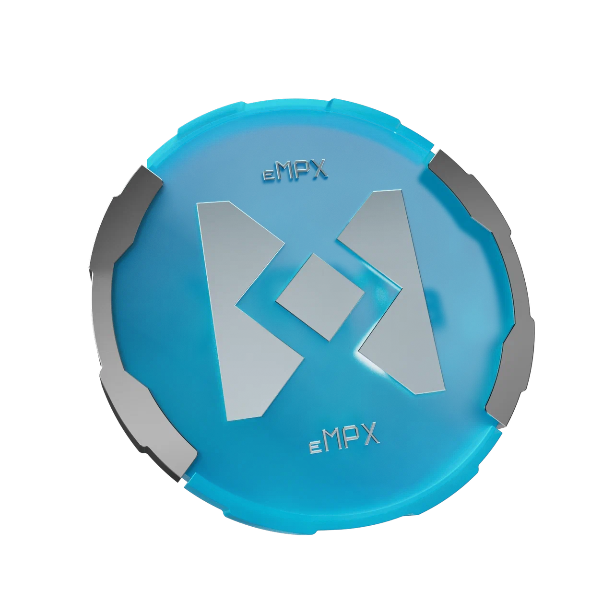

# eMPX Token

<figure><figcaption></figcaption></figure>

## Overview of eMPX: Tokenized MPX on CrossFi EVM 

eMPX is designed to operate seamlessly within the EVM layer of CrossFi, providing users with the flexibility to engage in the broader DeFi ecosystem. It mirrors the limited supply characteristic of MPX, ensuring that the token's value is preserved through scarcity. eMPX can be freely traded, sold, or purchased within the EVM framework, making it an attractive asset for users familiar with Ethereum-based tokens. MPX is CrossFi's cosmos native consensus coin, and staking MPX is the exclusive means of acquiring XFI, the primary gas and utility coin for the broader CrossFi ecosystem. The MPX token is not inherently tradeable within the Cosmos part of CrossFi's blockchain stack, therefore we are introducing eMPX so that users can freely trade MPX and unlock additional utilities in CrossFi's EVM ecosystem.

## Tokenomics

<figure><figcaption></figcaption></figure>

## Emission 

eMPX will account for 10% of the initial MPX supply, meaning that the total supply for eMPX will be 400,000,000 tokens. These tokens will be released over a 5-year vesting schedule as detailed below.

<figure><figcaption></figcaption></figure>

#### **Liquidity Pool and Incentivization** 

To encourage active participation and liquidity provision within the ecosystem, the CrossFi Foundation will establish a liquidity pool specifically for eMPX. Users who contribute to this pool by providing liquidity will be eligible for incentives in the form of XFI tokens in [xAPP](../../ecosystem/xapp/). This incentivization strategy aims to foster a vibrant and liquid market for eMPX, ensuring that users can easily trade and utilize the token within the ecosystem.

#### Token Utilities 

Outside of being liquid and tradeable unlike its Cosmos, eMPX has robust functionality in CrossFi [xAPP](../../ecosystem/xapp/).

1. At any moment, eMPX can be bridged to Cosmos to become eligible for staking rewards like regular MPX. The MPX can be bridged back again to be traded, exchanged, and more.
2. In CrossFi's xAPP, users will be directly incentivized to provide eMPX liquidity in exchange for continuous XFI rewards alongside trading fees for the pool.

#### **How to Participate** 

1. **Buying and Selling eMPX**: Users can acquire eMPX through exchanges and DEXes with the eMPX token listed (Details TBA). Once acquired, eMPX can be held as an investment, used for transactions, used in xAPP, or traded.
2. **Bridging eMPX to MPX**: To bridge eMPX to MPX, users will follow a simple, secure process facilitated by the CrossFi platform (Details TBA). This enables them to convert their eMPX into MPX for staking and participating in Cosmos network rewards.
3. **Providing Liquidity**: Users interested in liquidity provision can add their eMPX to the designated liquidity pool. In return, they will receive XFI tokens as incentives, aligning their contributions with tangible and attractive ecosystem rewards.

**Conclusion** eMPX represents a strategic expansion of the MPX utility within the CrossFi ecosystem, offering users the flexibility of EVM compatibility while maintaining a strong connection to the native Cosmos environment. By participating in the eMPX liquidity pool, bridging tokens for additional rewards, and engaging with the token on the EVM layer, users can maximize their involvement and benefit from the innovative financial solutions offered by CrossFi.\
