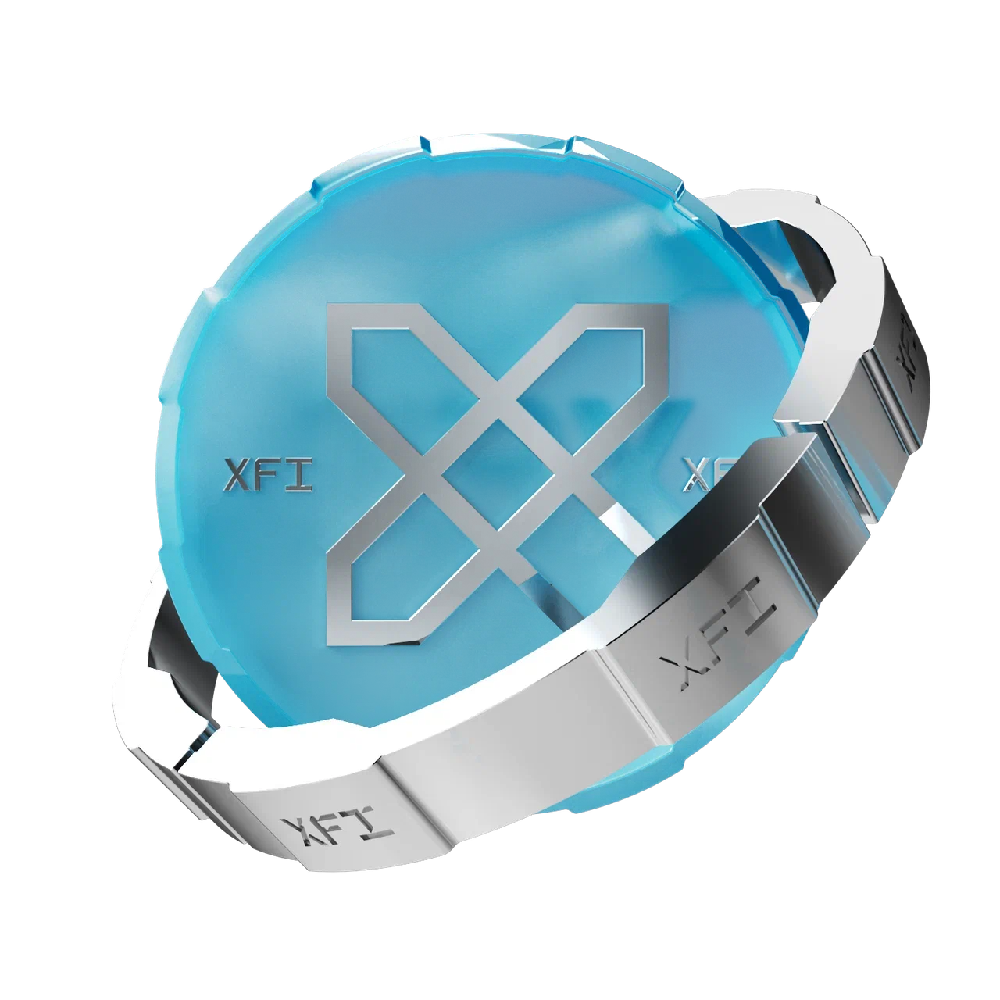

# XFI Coin

<figure><figcaption></figcaption></figure>

XFI is the primary utility and liquidity token within the CrossFi ecosystem, designed to support core economic operations across both Cosmos and EVM blockchain layers. It serves as the foundational asset for transaction fees, liquidity provision, staking activities, cross-chain interoperability, and as the main currency within decentralized CrossFi applications and financial products.

***

### Token Overview

| Parameter             | Description                             |
| --------------------- | --------------------------------------- |
| **Symbol**            | XFI                                     |
| **Ticker**            | XFI                                     |
| **Initial Emission**  | 0                                       |
| **Maximum Emission**  | 378,432,000                             |
| **Decimals**          | 18                                      |
| **Blockchain Format** | Cosmos-based blockchain (CrossFi Chain) |

***

### Primary Roles of XFI

* **EVM and Cosmos Integration**: XFI plays a critical role in integrating both EVM and Cosmos blockchain layers. It facilitates transactions across these environments, ensuring seamless interoperability and increasing its adoption across different blockchain ecosystems.
* **Multi-Layer Utility**: The token serves as a core utility within the CrossFi ecosystem, enabling the payment of transaction fees and providing access to various decentralized applications and services. By acting as a medium for interactions across the network, XFI ensures a unified experience for users across Cosmos-based and EVM-compatible environments.
* **Liquidity Provision and Staking**: A fundamental aspect of XFI’s role is its function in liquidity provisioning and staking. Users can contribute XFI to liquidity pools, receiving LP tokens representing their share in the ecosystem. These LP tokens can then be staked to earn additional rewards, including escrowed XFI (esXFI), standard XFI tokens, and wrapped Ethereum (WETH). Through this mechanism, XFI supports sustainable liquidity and incentivizes long-term participation.
* **XFI-MPX Staking**: XFI is directly integrated into the **XFI-MPX staking protocol**, where users can stake XFI to receive MPX, which is then delegated to Cosmos network validators. This automated system allows users to earn rewards in a fully decentralized manner while supporting the network’s security and stability. Staked XFI is locked in smart contracts, and participants receive dynamic rewards based on network staking participation and reward mechanisms. More details on the staking process, validator selection, and reward distribution can be found on the \[XFI-MPX Staking Protocol]\(link to staking page).
* **Flexible and Sustainable Economic Model**: XFI follows a flexible and sustainable economic model. Its emission is structured over a 20-year period, with a gradual reduction in the emission rate to maintain token scarcity and long-term value appreciation. Additionally, a token-burning mechanism is applied to base transaction fees in the EVM part of CrossFi Chain, continuously reducing supply and promoting economic stability.
* **Cross-Chain Bridging Capability**: As a cross-chain compatible asset, XFI leverages advanced bridging technology to facilitate smooth operations across various blockchain platforms. This capability allows users to transfer XFI between multiple networks, participate in decentralized finance (DeFi) activities across different ecosystems, and expand the overall reach of the token.

***

### XFI Emission Model

The emission of XFI tokens is structured over a 20-year period in five stages, gradually reducing the number of tokens issued per block to maintain a balance between availability and scarcity.

| Period             | Coins per Block | XFI Emission        |
| ------------------ | --------------- | ------------------- |
| 1-4 years          | 5               | 126,144,000         |
| 5-8 years          | 4               | 100,915,200         |
| 9-12 years         | 3               | 75,686,400          |
| 13-16 years        | 2               | 50,457,600          |
| 17-20 years        | 1               | 25,228,800          |
| **Total Emission** |                 | **378,432,000 XFI** |

Each block is generated every 5 seconds, leading to an estimated 6,307,200 blocks per year. To further sustain the token’s value, a portion of transaction fees in XFI is burned, reducing the overall circulating supply and reinforcing its deflationary model.

***
