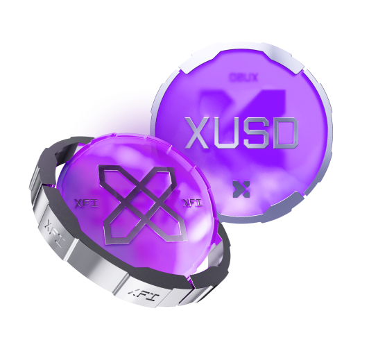

# xUSD

<figure><figcaption></figcaption></figure>

## xUSD Overview

xUSD is an algorithmic stablecoin deployed on the CrossFi Chain that is designed to maintain a 1:1 peg to the U.S. Dollar. Issued through the CrossFi xApp DeFi platform, xUSD is backed by a robust and transparent collateralization mechanism, ensuring both stability and liquidity in a fully decentralized environment.

***

### xUSD Token

xUSD is a CrossFi-native stablecoin that maintains its peg to the U.S. Dollar through a carefully engineered collateral system. To mint xUSD, users deposit their assets—primarily the native coin XFI—as collateral. For example, to mint 100 xUSD, a user must lock a minimum of $300 worth of XFI, reflecting a collateralization ratio of 300%. This high collateralization ensures that there is a significant buffer against market volatility.

If the value of XFI (the collateral) falls below a healthy threshold—specifically, when it dips to 200% of the minted xUSD—the position is automatically liquidated. In such an event, the collateral is used to cover the outstanding xUSD debt and associated liquidation fees, thus preserving the stability of the overall system.

<figure><figcaption></figcaption></figure>

***

### How to Use xUSD

xUSD is designed not only as a stable store of value but also as a versatile tool within the CrossFi ecosystem. It plays a central role in various blockchain applications and DeFi protocols. Here are some of the primary use cases:

* **Investments in Other Crypto Assets:**\
  xUSD can be used to invest in a diverse range of crypto assets without exposure to undue volatility.
* **DeFi Participation:**\
  xUSD is integrated across several key protocols on the CrossFi Chain:
  * **Staking:** Users can stake xUSD within platforms like [xApp](../ecosystem/xapp/) to earn additional incentives.
  * **Liquidity Provision:** xUSD is essential in liquidity pools such as xSwap, helping maintain overall ecosystem fluidity.
  * **Lending:** Platforms like PhoLend allow users to lend or borrow xUSD, further expanding its utility.
  * **Future Applications:** [xAssets platform](../ecosystem/xassets.md) will also incorporate xUSD, unlocking more advanced DeFi opportunities.

Additionally, xUSD provides a strategic advantage for XFI holders. Instead of selling XFI to make a purchase or trade an asset, users can lock a portion of their XFI as collateral to mint xUSD. After completing their transactions, they can repay the xUSD and retain their XFI balance—benefiting from potential appreciation while preserving their stake in the network.

***

### Collateralization Mechanism

xUSD is secured by a high collateralization model with a 1:3 ratio. This means that every 1 xUSD is backed by assets totaling three times its value. Key aspects of the collateral system include:

* **High Overcollateralization:**\
  A 300% collateralization requirement protects xUSD from volatility and inflation, offering enhanced stability compared to many other stablecoins.
* **Automated Liquidation:**\
  Should the collateral value (XFI) drop below the required healthy threshold (200% of the minted xUSD), an automated liquidation process is triggered. This process uses the locked XFI to cover the outstanding xUSD debt along with any applicable fees.
* **Transparent and Decentralized:**\
  All collateral reserves are secured and verified by smart contracts on the CrossFi Chain, ensuring full transparency and eliminating risks associated with third-party intervention or asset freezing.

***

### xUSD Compared to USDC and USDT

xUSD distinguishes itself from centralized stablecoins by being 100% backed by cryptocurrency assets (primarily XFI) and by operating in a completely decentralized manner. Consider the following comparison:

|                       | **xUSD**                                                                     | **USDT**                                                         | **USDC**                                                                  |
| --------------------- | ---------------------------------------------------------------------------- | ---------------------------------------------------------------- | ------------------------------------------------------------------------- |
| **Regulatory Stance** | Not regulated by design (fully decentralized)                                | Issued with some regulatory oversight, but centralized in nature | Issued by regulated financial institutions                                |
| **Risk of Blocking**  | No risk of asset blocking or freezing                                        | Subject to potential asset blocking due to centralized control   | Assets may be subject to blocking by the issuing entity                   |
| **Reserve Mechanism** | Fully transparent reserves secured by smart contracts (cryptocurrency-based) | Relies on fiat reserves with less transparency                   | Fully backed by fiat dollars, but requires reliance on centralized audits |

This comparison highlights xUSD’s decentralized and transparent nature, which mitigates risks commonly associated with centralized stablecoins.

***

### What Is an Algorithmic Stablecoin?

Algorithmic stablecoins, such as xUSD, maintain their peg to a fiat currency through automated mechanisms—using algorithms, smart contracts, and collateralization processes. They are designed to be highly liquid and serve as effective trading tools within the DeFi space. Unlike centralized stablecoins (e.g., USDT and USDC), which depend on fiat reserves managed by a single issuer, algorithmic stablecoins offer:

* **Decentralized Control:**\
  The user retains full control over assets without third-party intervention.
* **Robust Collateralization:**\
  A high collateralization ratio provides a significant buffer against market volatility.
* **Transparent Operations:**\
  All aspects of the stablecoin’s reserves and operations are verifiable on-chain via smart contracts.

***

### Key Advantages of xUSD

* **Decentralized Stability:**\
  xUSD operates on the CrossFi Chain, ensuring that funds remain in the direct control of users. The decentralized architecture eliminates risks related to centralized management or asset freezing.
* **High Liquidity and Flexibility:**\
  Integrated across various DeFi platforms, xUSD is a key component of liquidity pools, enabling seamless trading, lending, and staking operations.
* **Collateralized Security:**\
  With a collateralization ratio of 1:3 and automated liquidation mechanisms, xUSD is designed to remain stable even during market fluctuations.
* **Transparent and Trustworthy:**\
  Fully secured by smart contracts, the collateral reserves for xUSD are fully transparent, providing an additional layer of security and reliability for users.
* **Future-Proof Design:**\
  Plans to expand the variety of collateral assets may further enhance the stability and utility of xUSD, ensuring that it remains at the forefront of decentralized finance solutions.

***

xUSD is a cornerstone of the CrossFi ecosystem, providing a stable, reliable medium of exchange and a fundamental building block for a wide range of DeFi applications. Its robust, decentralized design offers users a secure method to participate in the digital economy while maintaining control over their own assets.

***
