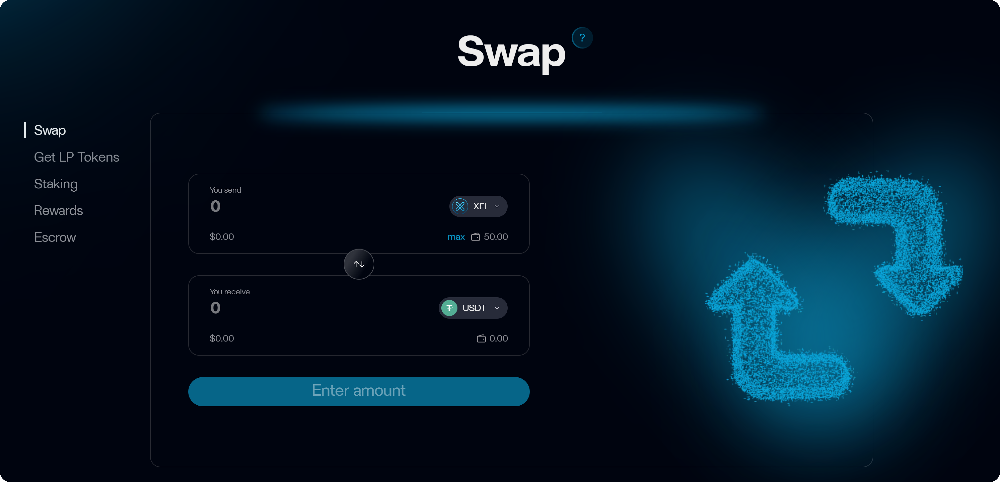

# CrossFi App (Web3 Banking)

<figure><figcaption></figcaption></figure>

CrossFi App is an innovative Web3 banking application designed to revolutionize the financial sector. Built on the CrossFi Chain blockchain, it seamlessly integrates decentralized finance (DeFi) with traditional banking services. The app enables users to conveniently and profitably use cryptocurrency as fiat in everyday transactions while ensuring secure and flexible asset management through an intuitive interface.

***

## Why Choose CrossFi App?

CrossFi App stands out with its unique combination of features, making financial management convenient, secure, and accessible:

* **Crypto-Fiat Integration**: Thanks to a unique gateway, CrossFi App allows users to use cryptocurrency like regular money—no extra steps or complex exchange processes required. All necessary conversions happen automatically "under the hood" in fractions of a second, enabling instant purchases and transfers.
* **Control and Sovereignty**: Unlike traditional banks that can manage your funds independently, CrossFi App employs a non-custodial approach. Private keys for connected wallets, along with full control over your funds, remain solely with you. At any time, you—and only you—can quickly and securely deposit or withdraw funds from the app.
* **Global Accessibility**: The app operates in over 90 countries, and the CrossFi Card is accepted at 100 million points worldwide.
* **Security**: Leveraging the CrossFi Chain and its architectural features, the app ensures complete security and transparency. All operations with connected wallets are processed through verified smart contracts, and any transaction can be traced using its hash. As security is a critical aspect, we’ll discuss it in more detail below.

***

## How It Works

### About CrossFi App

The cornerstone of CrossFi App is the CrossFi Card. Unlike traditional bank cards, the CrossFi Card is directly linked to your crypto assets. It looks and functions like a standard Visa card, ensuring full compatibility with the existing global payment infrastructure.

* **Virtual Card**: Instantly created, providing quick access to online purchases, contactless payments, and transfers to other CrossFi App users.
* **Physical Card**: In addition to the virtual version, you can order a physical card, which can be used like any other physical card, such as at ATMs. Note: A virtual card cannot later be converted into a physical one, so choose the physical option at the outset if needed.

***

### CrossFi Card Features

|                     | Virtual Card                       | Physical Card                      |
| ------------------- | ---------------------------------- | ---------------------------------- |
| **Issuance Cost**   | Free                               | Free (delivery fee applies)        |
| **Maintenance**     | Free                               | Free                               |
| **Availability**    | 90+ countries                      | 90+ countries                      |
| **Card Limit**      | Up to 3 per account                | Unlimited                          |
| **Transaction Fee** | 2% on all operations               | 2% on all operations               |
| **Cash Withdrawal** | Up to €300 free, then 2%           | Up to €300 free, then 2%           |
| **Usage**           | Online and contactless payments    | Online, offline, and ATMs          |
| **Currency**        | XFI (converted to fiat at payment) | XFI (converted to fiat at payment) |

***

### About the XFI Token

XFI is the native token of CrossFi Chain, powering transactions and access to the app’s features. When making payments or withdrawing cash, XFI is automatically converted to fiat at the current exchange rate.

* **Learn More**: XFI Coin
* **How to Obtain XFI**: Get Coins

***

### Security

CrossFi App provides the highest level of protection for you and your funds:

* Smart contracts have undergone independent audits and feature open-source code.
* Private keys are stored locally (e.g., in a MetaMask wallet).
* All data is protected with AES-256 encryption.
* Compliance with PCI DSS standards.
* Mandatory KYC/AML verification to prevent fraud.
* EU license for cryptocurrency operations.
* AI-powered monitoring and regular external audits.
* Transaction confirmation via OTP or biometrics.
* 24/7 support: [support@crossfi.com](mailto:support@crossfi.com)

***

## Using CrossFi App

CrossFi App offers an intuitive interface, allowing you to easily manage your crypto assets, make payments, and monitor all financial operations in one place.

***

### Getting Started

To start using CrossFi App, follow these simple steps:

1. Download the CrossFi App (for Android/iOS—links will be available after the official release).
2. Register an account by providing your phone number, email, password, and residential address.
3. Complete KYC verification. You can skip this step, but doing so will significantly limit the app’s functionality.
4. Create a virtual or physical CrossFi Card.
5. Connect a wallet (e.g., MetaMask).
6. Fund your account using the "Top Up" feature.

***

### Depositing and Withdrawing Funds

* To deposit funds, connect a wallet (e.g., MetaMask).
* Tap “Top Up” in the app.
* Funds are transferred to your CrossFi App balance via smart contracts.
* No need to sign transactions for each operation.
* To withdraw funds, select the “Unhold” option to transfer funds back to your wallet.

***

### Obtaining a Physical Card

To create a physical card, follow these steps:

1. **Choose a Name**: Provide your full name (first and last) or a shortened version (last name and first initial).
2. **Delivery Address**: Confirm or enter your delivery address.
3. **Select Delivery Type**: Standard ($5, 5–7 business days) or express ($15, 1–2 business days).
4. **Virtual Card Details**: After confirmation, you’ll receive details for a virtual card linked to the physical one, which can be used for online payments until the physical card arrives.

In some cases, additional identity verification (e.g., document upload or video confirmation) may be required to issue the card.

***

## Join CrossFi

CrossFi App ushers in a new era of financial possibilities. Start using cryptocurrency as effortlessly as regular money—download the CrossFi App and join the Web3 revolution today!
