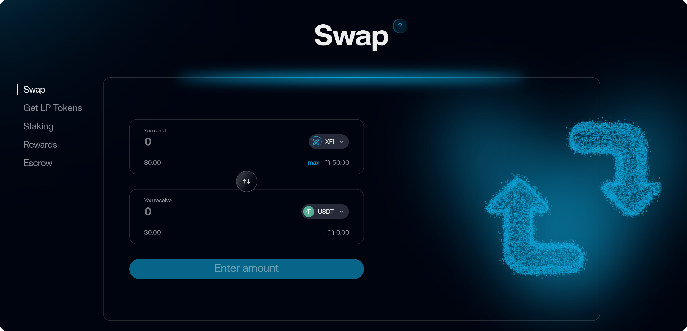

# Swap

The **Swap** section allows you to quickly and transparently exchange tokens within the CrossFi network, without using external platforms. All trades use an Automated Market Maker (AMM) model (_x·y = k_) and include a **1% fee**, fully returned to liquidity providers.

<figure><figcaption></figcaption></figure>

***

### Supported Assets

* **CrossFi tokens:** XFI, wXFI, eMPX, XUSD
* **Stablecoins and ERC-20 tokens:** USDT, USDC, EXE, etc.
* **External assets via bridges:** WETH (ETH), WBTC, BNB, SOL

Integration with **deBridge** enables bringing assets from any EVM-compatible chain into CrossFi Chain and swapping them directly within xAPP.

***

### Swap Walkthrough

1. **Select trading pair**
   * Go to the **Swap** tab.
   * In the "From" field, select the token you want to give, and in "To" — the token you want to receive.
   * Enter the amount for one token; the other is auto-calculated by rate.
2. **Review terms**
   * Check the rate and the 1% fee.
   * If the pool updates before confirmation, you’ll see a notice with the new rate — confirm or cancel.
3. **Approve (first-time swap for each token)**
   * The system will ask for permission (`Approve`) to spend your ERC-20 token.
   * This is a standard safety measure: approve once per token.
4. **Confirm transaction**
   * Click **Swap**.
   * Your wallet (MetaMask, WalletConnect, etc.) will prompt for transaction signature — confirm it.
5. **Result**
   * After confirmation in CrossFi network, new tokens are instantly sent to your address.
   * Check updated balances in **Dashboard** or other sections.

***

### Viewing Balances & Use Case

**After a successful swap**, refresh your **Dashboard** or visit relevant sections (LP Tokens, Staking, etc.) to see:

* the decreased balance of the token you swapped from,
* the increased balance of the token you swapped to.

CrossFi’s fast network finalizes trades in seconds — great for **dynamic rebalancing** and active trading.

**Example:**\
To boost liquidity in the **XFI/xUSD** pool, use **Swap** to trade some XFI to XUSD (or vice versa) until you have equal values, then go to **LP Tokens** to add liquidity. All steps — swap to LP deposit — happen within xAPP, saving time and cross-bridge fees.

***

**Tip:**\
Before providing liquidity or staking LP tokens, ensure you hold the correct asset ratio — it maximizes farming efficiency and minimizes slippage risks.
